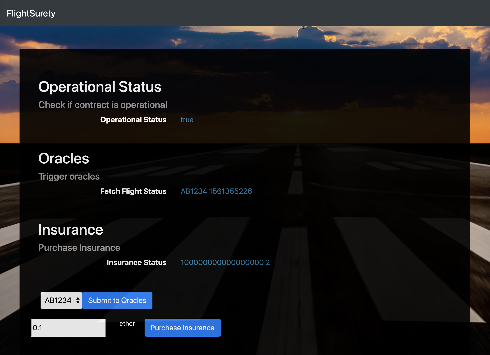

# FlightSurety

FlightSurety is a sample application project for Udacity's Blockchain course.

## Install

This repository contains Smart Contract code in Solidity (using Truffle), tests (also using Truffle), dApp scaffolding (using HTML, CSS and JS) and server app scaffolding.

To install, download or clone the repo, then:

`npm install`
`truffle compile`

## Develop Client

To run truffle tests:

`truffle test ./test/flightSurety.js`
```
Using network 'development'.


Compiling your contracts...
===========================
> Compiling ./contracts/FlightSuretyApp.sol
> Compiling ./contracts/FlightSuretyData.sol
> Artifacts written to /var/folders/qd/pqq3x5wj25x5wmzkp5ww7b000000gn/T/test-119524-97762-178j6mp.cqdwg
> Compiled successfully using:
   - solc: 0.5.9+commit.e560f70d.Emscripten.clang


  Contract: Flight Surety Tests
    ✓ (multiparty) has correct initial isOperational() value
    ✓ (multiparty) can block access to setOperatingStatus() for non-Contract Owner account (52ms)
    ✓ (multiparty) can allow access to setOperatingStatus() for Contract Owner account (54ms)
    ✓ (multiparty) can block access to functions using requireIsOperational when operating status is false (199ms)
    ✓ (airline) cannot register an Airline using registerAirline() if it is not funded (86ms)
    ✓ (airline) can fund itself (104ms)
    ✓ (airline) can be registered using registerAirline() if it is funded (101ms)
    ✓ Only existing (airline) can register a new airline using registerAirline()         until there are at leat four airlines registered it is funded (363ms)
    ✓ 5th (airline) will recieve vogtes utill it get registered (611ms)
    ✓ passenger can buy insurance for his ticket, event InsuranceBought emited (73ms)


  10 passing (2s)
```

`truffle test ./test/oracles.js`
```
Using network 'development'.


Compiling your contracts...
===========================
> Compiling ./contracts/FlightSuretyApp.sol
> Compiling ./contracts/FlightSuretyData.sol
> Artifacts written to /var/folders/qd/pqq3x5wj25x5wmzkp5ww7b000000gn/T/test-119524-98576-1t5cbuc.0izck
> Compiled successfully using:
   - solc: 0.5.9+commit.e560f70d.Emscripten.clang


  Contract: Oracles
Oracle Registered: 2, 6, 4
Oracle Registered: 0, 9, 7
Oracle Registered: 7, 2, 0
Oracle Registered: 3, 5, 4
Oracle Registered: 5, 8, 4
Oracle Registered: 3, 2, 5
Oracle Registered: 9, 2, 8
Oracle Registered: 5, 1, 4
Oracle Registered: 8, 3, 7
Oracle Registered: 9, 4, 8
Oracle Registered: 0, 4, 5
Oracle Registered: 2, 5, 0
Oracle Registered: 6, 4, 5
Oracle Registered: 2, 9, 7
Oracle Registered: 1, 3, 2
Oracle Registered: 8, 5, 4
Oracle Registered: 4, 7, 0
Oracle Registered: 8, 4, 1
Oracle Registered: 7, 4, 1
    ✓ can register oracles (2451ms)
    ✓ can request flight status (348ms)


  2 passing (3s)
```

To use the dapp:

`truffle migrate`
`npm run dapp`
```
> flightsurety@1.0.0 dapp /Users/ohora/Documents/horagong/project/blockchain/FlightSurety
> webpack-dev-server --mode development --config webpack.config.dapp.js

ℹ ｢wds｣: Project is running at http://localhost:8000/
ℹ ｢wds｣: webpack output is served from /
ℹ ｢wds｣: Content not from webpack is served from /Users/ohora/Documents/horagong/project/blockchain/FlightSurety/dapp
ℹ ｢wdm｣:    675 modules
ℹ ｢wdm｣: Compiled successfully.
```
To view dapp:

`http://localhost:8000`


## Develop Server

`npm run server`
`truffle test ./test/oracles.js`
```
> flightsurety@1.0.0 server /Users/ohora/Documents/horagong/project/blockchain/FlightSurety
> rm -rf ./build/server && webpack --config webpack.config.server.js


webpack is watching the files…

Hash: 33f0df7ead10b4b2be0f
Version: webpack 4.35.0
Time: 2923ms
Built at: 06/24/2019 2:44:32 PM
    Asset     Size  Chunks             Chunk Names
server.js  943 KiB       0  [emitted]  main
Entrypoint main = server.js
[0] multi webpack/hot/poll?1000 ./src/server/index 40 bytes {0} [built]
[./build/contracts/FlightSuretyApp.json] 1.02 MiB {0} [built]
[./build/contracts/FlightSuretyData.json] 1.07 MiB {0} [built]
[./node_modules/webpack/hot/log-apply-result.js] (webpack)/hot/log-apply-result.js 1.27 KiB {0} [built]
[./node_modules/webpack/hot/log.js] (webpack)/hot/log.js 1.34 KiB {0} [built]
[./node_modules/webpack/hot/poll.js?1000] (webpack)/hot/poll.js?1000 1.12 KiB {0} [built]
[./src/server/config.json] 180 bytes {0} [built]
[./src/server/index.js] 308 bytes {0} [built]
[./src/server/server.js] 6.32 KiB {0} [built]
[babel-polyfill] external "babel-polyfill" 42 bytes {0} [built]
[express] external "express" 42 bytes {0} [built]
[http] external "http" 42 bytes {0} [built]
[web3] external "web3" 42 bytes {0} [built]

WARNING in configuration
The 'mode' option has not been set, webpack will fallback to 'production' for this value. Set 'mode' option to 'development' or 'production' to enable defaults for each environment.
You can also set it to 'none' to disable any default behavior. Learn more: https://webpack.js.org/configuration/mode/
Registering ORACLEs.

Oracle: address[0xc449a27B106BE1120Bd1Fd62F8166A2F61588eb9], indexes[2,3,8]
Oracle: address[0xF24AE9CE9B62d83059BD849b9F36d3f4792F5081], indexes[9,0,5]
Oracle: address[0xc44B027a94913FB515B19F04CAf515e74AE24FD6], indexes[1,8,2]
Oracle: address[0xcb0236B37Ff19001633E38808bd124b60B1fE1ba], indexes[3,5,2]
Oracle: address[0x715e632C0FE0d07D02fC3d2Cf630d11e1A45C522], indexes[4,0,8]
Oracle: address[0x90FFD070a8333ACB4Ac1b8EBa59a77f9f1001819], indexes[6,7,3]
Oracle: address[0x036945CD50df76077cb2D6CF5293B32252BCe247], indexes[8,2,0]
Oracle: address[0x23f0227FB09D50477331D2BB8519A38a52B9dFAF], indexes[9,2,0]
Oracle: address[0x799759c45265B96cac16b88A7084C068d38aFce9], indexes[7,2,9]
Oracle: address[0xA6BFE07B18Df9E42F0086D2FCe9334B701868314], indexes[8,6,4]
Oracle: address[0x39Ae04B556bbdD73123Bab2d091DCD068144361F], indexes[4,2,1]
Oracle: address[0x068729ec4f46330d9Af83f2f5AF1B155d957BD42], indexes[7,5,2]
Oracle: address[0x9EE19563Df46208d4C1a11c9171216012E9ba2D0], indexes[5,7,0]
Oracle: address[0x04ab41d3d5147c5d2BdC3BcFC5e62539fd7e428B], indexes[5,2,1]
Oracle: address[0xeF264a86495fF640481D7AC16200A623c92D1E37], indexes[4,2,3]
Oracle: address[0x645FdC97c87c437da6b11b72471a703dF3702813], indexes[8,6,2]
Oracle: address[0xbE6f5bF50087332024634d028eCF896C7b482Ab1], indexes[1,9,6]
Oracle: address[0xcE527c7372B73C77F3A349bfBce74a6F5D800d8E], indexes[7,0,1]
Oracle: address[0x21ec0514bfFefF9E0EE317b8c87657E4a30F4Fb2], indexes[1,4,9]
Oracle: address[0xEAA2fc390D0eC1d047dCC1210a9Bf643d12de330], indexes[5,0,9]
Oracle: address[0xC5fa34ECBaF44181f1d144C13FBaEd69e76b80f1], indexes[0,9,7]
Start watching for event OracleRequest to submit responses.
```

## Deploy

To build dapp for prod:
`npm run dapp:prod`

Deploy the contents of the ./dapp folder


## Resources

* [How does Ethereum work anyway?](https://medium.com/@preethikasireddy/how-does-ethereum-work-anyway-22d1df506369)
* [BIP39 Mnemonic Generator](https://iancoleman.io/bip39/)
* [Truffle Framework](http://truffleframework.com/)
* [Ganache Local Blockchain](http://truffleframework.com/ganache/)
* [Remix Solidity IDE](https://remix.ethereum.org/)
* [Solidity Language Reference](http://solidity.readthedocs.io/en/v0.4.24/)
* [Ethereum Blockchain Explorer](https://etherscan.io/)
* [Web3Js Reference](https://github.com/ethereum/wiki/wiki/JavaScript-API)